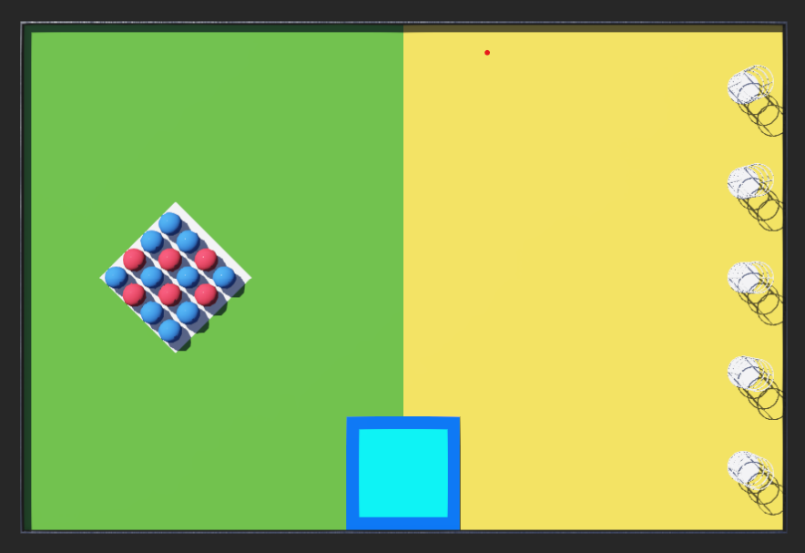

# IESL_Robo_Games_23

## Our Attempt at the Simulation Task – RoboGames 2023

In the **Preliminary Round** of RoboGames 2023, we had the chance to work on an exciting simulation challenge using Webots. Our goal was to program a robot to pick up and stack colored balls into towers. It was a fun and challenging experience!

### The Arena

The arena had 16 balls, either red or blue, arranged in a grid. There were also five white hollow towers where we needed to stack the balls. The tricky part was that each tower could only hold three balls, and we had to make sure the top ball was always red. We started the task in the light blue zone, where our robot was placed at the beginning.

### The Task

The task seemed straightforward at first – pick up the balls and stack them inside the towers. But there were some rules that made it more interesting:
- The robot could carry only **two balls at a time**.
- We had **five minutes** to stack as many balls as possible.
- We scored higher when we stacked the balls correctly, with a red ball on top.

### Our Experience

Programming the robot was quite fun. We had to make sure it could detect the balls, pick them up, and place them in the towers without violating any rules. It took a few tries to get the robot to work smoothly, but once we figured out the ball detection and stacking logic, things started to fall into place.

### Scoring

Here’s how the scoring worked:
- A tower fully stacked with a red ball on top gave us **100 points**.
- If the tower had all three balls but the order was wrong, we got **40 points**.
- Towers with fewer balls scored lower, but every ball stacked helped boost our score.

We spent a lot of time fine-tuning the robot to stack as quickly and accurately as possible. It was a great learning experience, and we’re excited to see how we can improve from here!

